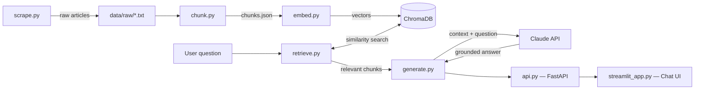

# Freshdesk Docs RAG Assistant

A Retrieval-Augmented Generation (RAG) system that answers questions about
Freshdesk's help documentation using Claude — grounded strictly in real,
retrieved article content instead of relying on the model's general
knowledge.

## Why RAG, not just asking Claude directly

Asking an LLM a question about a specific product's documentation directly
risks confident-sounding but incorrect answers, since the model was never
trained specifically on that documentation. This project instead retrieves
the most relevant real article excerpts first, then asks Claude to answer
*using only that retrieved context* — and returns an honest "I don't know"
when nothing relevant is found, rather than guessing.

## Architecture



**Pipeline stages:**
1. **Scrape** — downloads Freshdesk help articles as plain text
2. **Chunk** — splits articles into overlapping ~500-character pieces
3. **Embed** — converts chunks into vectors, stored in ChromaDB
4. **Retrieve** — finds the most relevant chunks for a given question,
   filtering out anything below a similarity threshold
5. **Generate** — sends retrieved context + question to Claude, grounded
   by a strict system prompt
6. **Serve** — FastAPI exposes this as a `/query` endpoint; a Streamlit
   chat UI provides a human-friendly front end on top of it

## Tech Stack

- **Retrieval:** ChromaDB (vector database), `sentence-transformers`
  (local embedding model, `all-MiniLM-L6-v2`)
- **Generation:** Claude API (`anthropic` SDK)
- **Backend:** FastAPI, Pydantic
- **UI:** Streamlit
- **Testing:** pytest (10 tests — chunking, retrieval accuracy, API
  behavior, error handling)
- **Infra:** Docker + docker-compose, GitHub Actions CI

## Getting Started

### Prerequisites
- Python 3.10
- A Claude API key ([console.anthropic.com](https://console.anthropic.com))
- Docker Desktop (optional, for containerized run)

### Local setup
```bash
git clone <your-repo-url>
cd docs-rag-assistant
python -m venv venv
venv\Scripts\activate        # Windows
pip install -r requirements.txt
```

Create a `.env` file in the project root: 

ANTHROPIC_API_KEY=your-key-here

Build the pipeline (only needed once, or after adding new articles):
```bash
python scrape.py
python chunk.py
python embed.py
```

### Run the API
```bash
uvicorn api:app --reload
```
Visit `http://127.0.0.1:8000/docs` for interactive API docs.

### Run the chat UI
In a second terminal (with the API already running):
```bash
streamlit run streamlit_app.py
```

### Run with Docker instead
```bash
docker compose up --build
```

## Testing

```bash
pytest -v
```

Run the retrieval accuracy eval separately:
```bash
python eval_retrieval.py
```

## Configuration

All tunable parameters (chunk size, retrieval top-k, similarity threshold,
Claude model, token limits) live in `config.py` and can be overridden via
`.env` — see `config.py` for the full list and defaults.

## CI

Every push to `main` automatically rebuilds the full pipeline from raw
article data and runs the full test suite via GitHub Actions
(`.github/workflows/tests.yml`).

## Project Structure

```
docs-rag-assistant/
├── scrape.py              # Downloads Freshdesk articles
├── chunk.py                # Splits articles into chunks
├── embed.py                 # Embeds chunks into ChromaDB
├── retrieve.py               # Finds relevant chunks for a query
├── generate.py                # Calls Claude with retrieved context
├── api.py                      # FastAPI backend
├── streamlit_app.py             # Chat UI
├── config.py                     # Centralized tunable settings
├── logger.py                      # Structured logging setup
├── cache.py                        # Query + embedding caching
├── eval_retrieval.py                # Retrieval accuracy evaluation
├── data/
│   ├── raw/                          # Scraped article text
│   ├── eval_set.json                  # Retrieval eval questions
│   └── processed/                      # Generated (gitignored)
├── tests/                               # pytest suite
├── Dockerfile
├── docker-compose.yml
└── .github/workflows/tests.yml
```